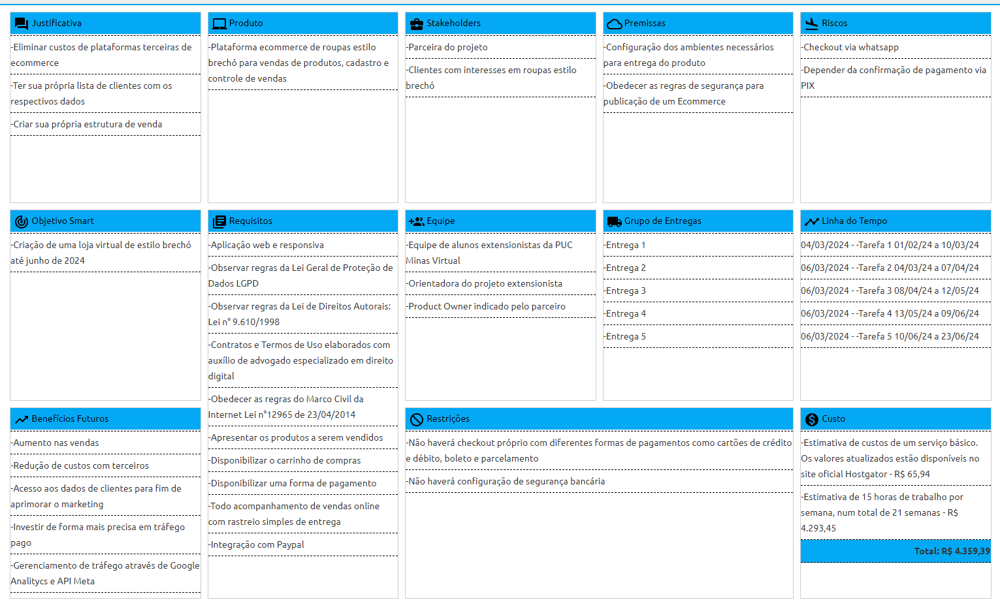

# Especificações do Projeto

Visando a criação de um site Web para contornar a taxa abusiva dos sites de marketplace desenvolvemos esse projeto, para mais informações de contexto acesse: <a href="1-Documentação de Contexto.md"> Documentação de Contexto</a>

## Arquitetura e Tecnologias

As tecnologias usadas no nosso projeto foram: PHP, o Framework Laravel, e para banco de dados foi usado o PostgreSQL

## Project Model Canvas

## Requisitos

As tabelas que se seguem apresentam os requisitos funcionais e não funcionais que detalham o escopo do projeto. Para determinar a prioridade de requisitos, aplicar uma técnica de priorização de requisitos e detalhar como a técnica foi aplicada.

### Requisitos Funcionais

|ID    |Descrição do Requisito  |Prioridade|
|------|--------------------------------------------|----|
|RF_001|Permitir o CRUD dos produtos.|ALTA| 
|RF_002|Permitir o CRUD dos usuários.|ALTA| 
|RF_003|Filtrar itens por (categoria, marca, estado, preço, relevância.|ALTA|
|RF_004|Enviar usuario para o Whatsapp do vendedor a fim de finalizar a venda.|ALTA|
|RF_005|Avaliar qualidade do produto e atendimento.|ALTA|
|RF_006|Visualizar histórico de compras e vendas.|BAIXO|
|RF_007|Gerenciar permissões de acesso.|ALTA|
|RF_008|Gerenciar produtos da loja.|ALTA|
|RF_009|Favoritar produtos.|MÉDIA|
|RF_010|Adicionar e retirar produtos do carrinho de compras.|MÉDIA|
|RF_011|Visualizar relatórios de vendas e compras e monitorar o desempenho da plataforma.|MÉDIA|

### Requisitos não Funcionais

|ID     | Descrição do Requisito  |Prioridade |
|-------|-------------------------|----|
|RNF_001| Plataforma deve funcionar em desktops, tablets e smartphones. | ALTA | 
|RNF_002| Carregamento rápido e eficiente das páginas. |  ALTA | 
|RNF_003| Lidar com um grande número de usuários simultâneos. |  ALTA |
|RNF_004| Proteger informações dos usuários, transações financeiras e estar em conformidade com leis de proteção de dados. |  ALTA |
|RNF_005| Interface intuitiva, processo de compra/venda simples e rápido, recursos de ajuda e suporte aos usuários. |  ALTA |
|RNF_006| Código bem documentado, fácil de manter e atualizar com novas funcionalidades. |  ALTA |
|RNF_007| Monitorar o bom funcionamento da plataforma, desempenho e detectar/corrigir erros e falhas. |  ALTA |

## Restrições

O projeto está restrito pelos itens apresentados na tabela a seguir.

|ID| Restrição                                             |
|--|-------------------------------------------------------|
|01| O projeto deverá ser entregue até o final do semestre |
|02| Não pode ser desenvolvido um módulo de backend        |

## Diagrama de Casos de Uso 

## Modelo ER (Projeto Conceitual)

## Projeto da Base de Dados

