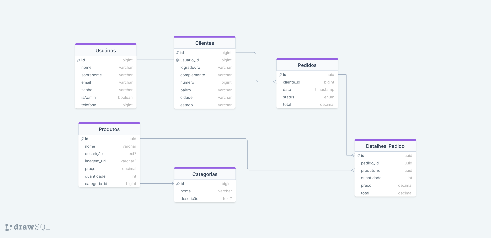

# Especificações do Projeto

Pré-requisitos: <a href="1-Documentação de Contexto.md"> Documentação de Contexto</a>

Definição do problema e ideia de solução a partir da perspectiva do usuário. É composta pela definição do  diagrama de personas, histórias de usuários, requisitos funcionais e não funcionais além das restrições do projeto.

Apresente uma visão geral do que será abordado nesta parte do documento, enumerando as técnicas e/ou ferramentas utilizadas para realizar a especificações do projeto

## Arquitetura e Tecnologias

o	Descreva brevemente a arquitetura definida para o projeto e as tecnologias a serem utilizadas. Sugere-se a criação de um diagrama de componentes da solução.

## Project Model Canvas

Colocar a imagem do modelo construído apresentando a proposta de solução.

> **Links Úteis**:
> Disponíveis em material de apoio do projeto

## Requisitos

As tabelas que se seguem apresentam os requisitos funcionais e não funcionais que detalham o escopo do projeto. Para determinar a prioridade de requisitos, aplicar uma técnica de priorização de requisitos e detalhar como a técnica foi aplicada.

### Requisitos Funcionais

|ID    | Descrição do Requisito  | Prioridade |
|------|-----------------------------------------|----|
|RF-001| Permitir o cadastro de fotos, título, categoria, tamanho, marca, estado, detalhes e preço do produto. | ALTA | 
|RF-002| Editar informações, pausar/ativar venda e excluir produtos.   | ALTA |
|RF-003| Receber ofertas, aceitar/recusar ofertas, gerar etiquetas de envio e registrar a venda.   | ALTA |
|RF-004| Responder perguntas, informar status do pedido e resolver problemas de entrega/devolução.   | ALTA |
|RF-005| Filtrar por categoria, tamanho, marca, estado, preço; visualizar fotos e detalhes; ordenar por relevância, preço ou data.   | ALTA |
|RF-006| Fazer ofertas, efetuar pagamento, selecionar método de envio e rastrear pedido.   | ALTA |
|RF-007| Avaliar qualidade do produto e atendimento; deixar comentários sobre a experiência de compra.   | ALTA |
|RF-008| Cadastrar nome, e-mail, senha, endereço e definir preferências de recebimento de notificações.   | ALTA |
|RF-009| Editar informações, alterar senha e visualizar histórico de compras e vendas.   | MÉDIA |
|RF-010| Enviar e receber mensagens com outros usuários.   | MÉDIA |
|RF-011| Cadastrar, editar e excluir usuários; gerenciar permissões de acesso.   | ALTA |
|RF-012| Remover produtos inativos/irregulares e analisar denúncias de produtos.   | MÉDIA |
|RF-013| Visualizar relatórios de vendas e compras e monitorar o desempenho da plataforma.   | MÉDIA |
### Requisitos não Funcionais

|ID     | Descrição do Requisito  |Prioridade |
|-------|-------------------------|----|
|RNF-001| Plataforma deve funcionar em desktops, tablets e smartphones. | ALTA | 
|RNF-002| Carregamento rápido e eficiente das páginas. |  ALTA | 
|RNF-003| Lidar com um grande número de usuários simultâneos. |  ALTA |
|RNF-004| Proteger informações dos usuários, transações financeiras e estar em conformidade com leis de proteção de dados. |  ALTA |
|RNF-005| Interface intuitiva, processo de compra/venda simples e rápido, recursos de ajuda e suporte aos usuários. |  ALTA |
|RNF-006| Código bem documentado, fácil de manter e atualizar com novas funcionalidades. |  ALTA |
|RNF-007| Monitorar o bom funcionamento da plataforma, desempenho e detectar/corrigir erros e falhas. |  ALTA |

Com base nas Histórias de Usuário, enumere os requisitos da sua solução. Classifique esses requisitos em dois grupos:

- [Requisitos Funcionais
 (RF)](https://pt.wikipedia.org/wiki/Requisito_funcional):
 correspondem a uma funcionalidade que deve estar presente na
  plataforma (ex: cadastro de usuário).
- [Requisitos Não Funcionais
  (RNF)](https://pt.wikipedia.org/wiki/Requisito_n%C3%A3o_funcional):
  correspondem a uma característica técnica, seja de usabilidade,
  desempenho, confiabilidade, segurança ou outro (ex: suporte a
  dispositivos iOS e Android).
Lembre-se que cada requisito deve corresponder à uma e somente uma
característica alvo da sua solução. Além disso, certifique-se de que
todos os aspectos capturados nas Histórias de Usuário foram cobertos.

## Restrições

O projeto está restrito pelos itens apresentados na tabela a seguir.

|ID| Restrição                                             |
|--|-------------------------------------------------------|
|01| O projeto deverá ser entregue até o final do semestre |
|02| Não pode ser desenvolvido um módulo de backend        |

Enumere as restrições à sua solução. Lembre-se de que as restrições geralmente limitam a solução candidata.

> **Links Úteis**:
> - [O que são Requisitos Funcionais e Requisitos Não Funcionais?](https://codificar.com.br/requisitos-funcionais-nao-funcionais/)
> - [O que são requisitos funcionais e requisitos não funcionais?](https://analisederequisitos.com.br/requisitos-funcionais-e-requisitos-nao-funcionais-o-que-sao/)

## Diagrama de Casos de Uso 

## Modelo ER (Projeto Conceitual)

O Modelo ER representa através de um diagrama como as entidades (coisas, objetos) se relacionam entre si na aplicação interativa.

## Projeto da Base de Dados

O projeto da base de dados corresponde à representação das entidades e relacionamentos identificadas no Modelo ER, no formato de tabelas, com colunas e chaves primárias/estrangeiras necessárias para representar corretamente as restrições de integridade.

